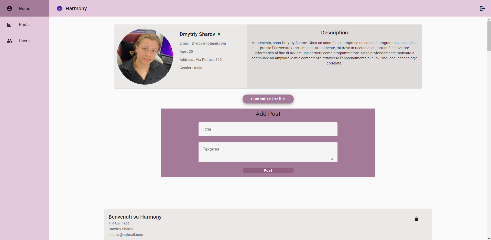
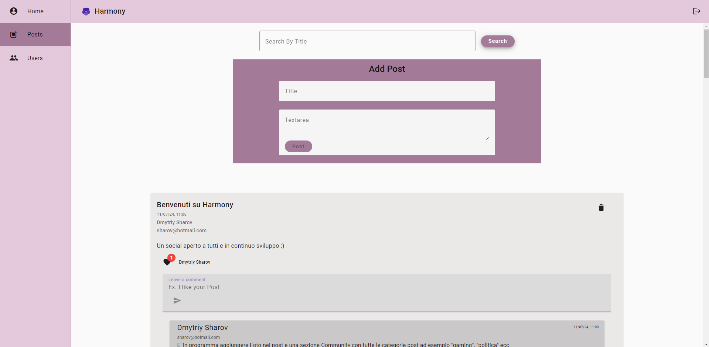
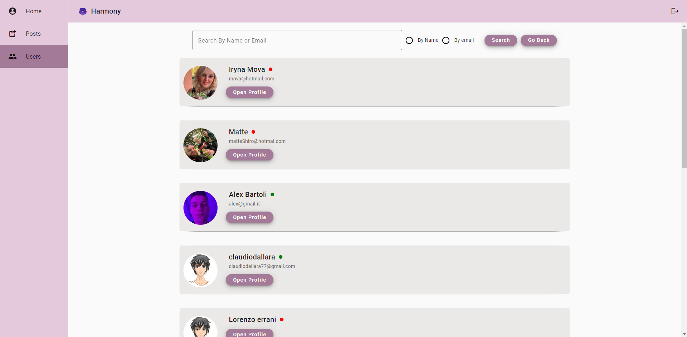

# Harmony

Harmony is a social media platform designed to foster connection and interaction among users. This project was developed as the final examination for the Start2Impact course.

## Features

- **User Registration and Authentication**: Users can create an account by registering with their email and a password. Once registered, users can log in using their credentials.

- **Profile Customization**: Users have the ability to personalize their profiles by adding additional information such as:

  - Profile picture
  - Address
  - Self-description
  - Age.

- **Post Creation and Interaction**: Users can create new posts, comment on their own and others' posts, and like posts. Additionally, users have the capability to delete their own posts.

- **User Directory**: Harmony allows users to view a directory of all registered users, facilitating easy discovery and interaction.

- **Search Functionality**: Users can search for posts by title and find other users by name or email.

## Technology Stack

- **Front End**: Developed with Angular, providing a dynamic and responsive user interface.
- **Back End**: Built with Node.js, ensuring a scalable and efficient server-side environment.

## Deployment

- **Client Side**: The front end of Harmony is deployed on [Vercel](https://vercel.com/).

- **Server Side**: The back end of Harmony is deployed on [Render](https://render.com/).

## Live Demo

Experience Harmony by trying the live demo here: [Harmony Demo](https://harmony-smoky.vercel.app/)

## Development

This project was generated with [Angular CLI](https://github.com/angular/angular-cli) version 15.2.10.

## Install

Run `npm run install-server-client` on your device to install dependencies.

## Angular Material

To install Angular Material run `ng add @angular/material`

## Run Application

- To start the server, run: `npm run start-server`

- Then, in a different terminal, run the following command to start the Angular development server and open the application in your default web browser: `ng serve --open`

## Code scaffolding

Run `ng generate component component-name` to generate a new component. You can also use `ng generate directive|pipe|service|class|guard|interface|enum|module`.

## Build

Run `ng build` to build the project. The build artifacts will be stored in the `dist/` directory.

## Further help

To get more help on the Angular CLI use `ng help` or go check out the [Angular CLI Overview and Command Reference](https://angular.io/cli) page.

## ScreenShots

